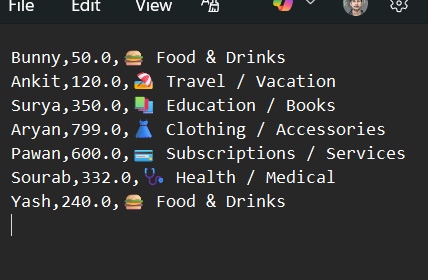
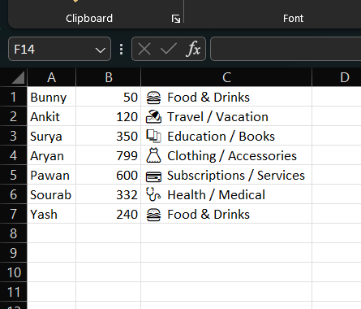

# 💰 Expense Tracker

A simple **Python-based Personal Expense Tracking App** that helps you log daily expenses, categorize them, and calculate how much you can still spend within your budget.

This project uses **CSV files** to store data, making it lightweight and easy to export to **Excel** or **Google Sheets**.

---

## 🎯 Features
- Add expenses (name, category, amount) directly from the terminal  
- Save expenses to a `.csv` file  
- Summarize expenses by **category**  
- Show **total spent** and **budget remaining**  
- Estimate **daily budget** for the rest of the month  
- Customizable budget limit (default: ₹20,000)

---

## 🗂️ Project Structure
expense-tracker/
│── expense.py # Defines the Expense class
│── expenses_tracker.py # Main application logic
│── expenses.csv # Stores expense data (auto-generated)
│── .gitignore # Git ignore rules
│── README.md # Project documentation

---

## ⚙️ Installation & Usage

1. Clone this repository:
   git clone https://github.com/Subhranshuu/expense-tracker.git
   cd expense-tracker
   
## (Optional) Create a virtual environment:
python -m venv venv
source venv/bin/activate   # Linux / macOS
venv\Scripts\activate      # Windows

## Run the app:
python expenses_tracker.py

## Example Output

🎯 Running Expense Tracker!
🎯 Getting User Expense
Enter expense name: Coffee
Enter expense amount: 50
Select a category:
  1. 🍔 Food & Drinks
  2. 🏠 Housing / Rent
  3. 💼 Work / Office
  4. 🎉 Entertainment / Fun
  ...
Enter a category number [1-14]: 1

🎯 Saving User Expense: Expense(name='Coffee', category='🍔 Food & Drinks', amount=50.00) to expenses.csv
🎯 Summarizing User Expenses

Expenses By Category 📈:
  🍔 Food & Drinks: ₹500.00
  🎉 Entertainment / Fun: ₹200.00

💵 Total Spent: ₹700.00
✅ Budget Remaining: ₹19,300.00
👉 Budget Per Day: ₹643.33

## 🖼️ Screenshot

Here’s how the app looks in action:

## ✨ Future Improvements

1.Add a graphical dashboard (Tkinter / Web UI)
2.Export reports as PDF or Excel
3.Set multiple budgets (weekly, monthly)
4.Notifications when spending exceeds budget

# 💰 Expense Tracker

